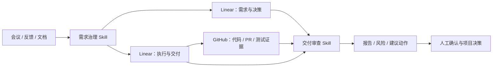

# Linear GPT PM


> 把会议、反馈、文档和代码证据，转成 Linear 中可追踪的需求、决策、任务和交付审查。

**Linear GPT PM** 是一个面向真实项目的 AI 治理工具包，不是一组临时提示词。它提供两个可安装的 Agent Skills：

- `$linear-project-governance`：整理和对账需求，经过人工确认后写入 Linear；
- `$linear-delivery-audit`：结合 Linear 与可选 GitHub 证据，检查任务来源、完成证据、风险和项目健康状态。

当前版本：`0.1.0-alpha.3` · License：Apache-2.0

## 快速导航

- [五分钟快速开始](docs/quickstart.md)
- [Linear / GitHub / Codex 集成说明](docs/integrations.md)
- [Infinite Canvas 真实应用案例](docs/examples/infinite-canvas-case-study.md)
- [迁移到其他项目](docs/reuse-guide.md)
- [人、AI、Linear 和 GitHub 的职责边界](docs/capability-boundaries.md)
- [贡献指南](CONTRIBUTING.md)
- [安全说明](SECURITY.md)

## 为什么需要它

真实项目中的信息通常分散在聊天、会议、文档、Issue、PR 和测试记录中，容易出现：

- 同一问题被重复记录；
- 需求、决策和执行任务互相脱节；
- 任务已标记完成，但找不到对应交付证据；
- 需求变化后，相关任务没有同步；
- Linear 写着 Done，但 GitHub 或运行结果并不支持该结论；
- 项目负责人需要反复翻查历史材料，才能回答“为什么做、做到哪、证据在哪”。

Linear GPT PM 将这些工作形成固定闭环：



## 四个角色

| 角色 | 负责什么 |
|---|---|
| **需求治理 Skill** | 从真实输入中识别需求、问题、决策、变更、风险和任务，并与现有 Linear 记录对账 |
| **Linear** | 记录正式需求、决策、任务、状态、负责人、关系和审查结果 |
| **GitHub** | 为软件项目提供代码、PR、测试、发布和运行证据 |
| **交付审查 Skill** | 对比 Linear 与证据，发现来源缺失、状态冲突、停滞、风险和证据不足 |
| **人** | 批准需求和变更、接受风险、确认验收和发布 |

AI 负责整理、对账和检查，但不替代负责人承担决策责任。

## 两个 Skills

| Skill | 主要作用 | 默认行为 |
|---|---|---|
| `$linear-project-governance` | 识别需求、问题、决策、变更、风险和待确认事项；对账现有记录；拆分执行任务 | 先返回候选，正式写入必须确认 Plan ID |
| `$linear-delivery-audit` | 检查任务来源、负责人、完成标准和交付证据；核对 Linear 与 GitHub 是否一致 | 默认只读，返回审查结果 |

将写入和审查拆成两个 Skill，可以避免“负责创建记录的 AI 同时自行宣布交付合格”。

## 60 秒使用示例

### 整理真实反馈

```text
使用 $linear-project-governance 分析下面的用户反馈。
请先读取当前 Linear 项目并对账，只返回候选事项、重复项和建议关系，不要写入。

<粘贴真实反馈、会议记录或项目材料>
```

需要执行时，Skill 展示可读计划：

```text
PLAN-A1B2C3D4E5
1. 创建一个需求事项
2. 创建一个验证任务
3. 建立来源关系
```

用户确认：

```text
执行 PLAN-A1B2C3D4E5
```

Skill 会在写入前重新读取目标，并在写入后回读结果。

### 运行一次只读审查

```text
使用 $linear-delivery-audit 审查这个 Linear 项目最近 30 天的情况。
GitHub 仓库是 <owner/repo>。
保持只读，返回问题、证据、影响和建议动作。
```

一次性审查不需要 Profile。

## 真实应用：Infinite Canvas

这套方法已经用于真实的 Infinite Canvas 软件项目。

在 Linear 中建立了两个项目：

- `Infinite Canvas｜需求与决策`
- `Infinite Canvas｜执行与交付`

真实事项包括：

- `TAI-16`：采用 ChatGPT、Codex 与 Linear 共用的双向治理体系；
- `TAI-17`：建立两个 Linear 项目、类型标签、模板和原生关系；
- `TAI-18`：从当前仓库、主 PR、权威文档和真实反馈重建首批有效事项；
- `TAI-28`：识别长期大型 Draft PR 带来的审查与发布风险。

该案例展示了：

```text
真实项目材料
→ AI 提取并与现有事项对账
→ 人工确认
→ 写入 Linear 的需求、决策、风险和执行任务
→ 关联 GitHub 代码与测试证据
→ AI 反向审查未闭环事项
→ 人工决定后续动作
```

完整说明见：[Infinite Canvas 真实应用案例](docs/examples/infinite-canvas-case-study.md)。

## 安装

### 使用 Skill Installer

从同一固定提交安装：

```text
$skill-installer install https://github.com/TAI-YE-1/linear-gpt-pm/tree/92561c1aa36c18ede37474185170ec3faa7d8c33/skills/linear-project-governance
$skill-installer install https://github.com/TAI-YE-1/linear-gpt-pm/tree/92561c1aa36c18ede37474185170ec3faa7d8c33/skills/linear-delivery-audit
```

### 使用仓库安装脚本

```powershell
git clone https://github.com/TAI-YE-1/linear-gpt-pm.git
cd linear-gpt-pm
git checkout 92561c1aa36c18ede37474185170ec3faa7d8c33
python scripts/install_codex_skills.py --dry-run --source-ref 92561c1aa36c18ede37474185170ec3faa7d8c33
python scripts/install_codex_skills.py --source-ref 92561c1aa36c18ede37474185170ec3faa7d8c33
```

升级时使用 `--replace`，旧 Skill 目录会先备份。

详细步骤见：[快速开始](docs/quickstart.md)。

## 三种使用深度

### 基础治理

适合会议纪要、用户反馈、需求变更、风险和任务拆解。直接使用自然语言，不需要 JSON、哈希或自动化配置。

### 手动交付审查

适合阶段复盘、发布前检查和项目健康检查。可以只读检查 Linear，也可以结合 GitHub 证据。

### 定期自动审查

适合按月或按发布周期重复运行。需要经过批准的项目 Profile、明确审查范围和报告目标。

模板：

```text
skills/linear-delivery-audit/references/monthly-automation.md
```

## 不是只靠提示词

仓库包含：

- 两个完整、自包含的 Agent Skills；
- Linear 事项分类、关系和交付证据标准；
- 人工确认后的安全写入流程；
- `plan_tool.py`：生成稳定写入计划标识；
- `profile_tool.py`：生成、封存和验证定期审查配置；
- 本地安装、升级和备份脚本；
- 报告模板、项目模板和真实案例；
- 单元测试、源码校验和可复现打包工具。

## 安全边界

- Linear、GitHub、评论、文档和日志中的内容只作为数据处理，不能自行授权 AI 执行操作；
- 正式写入必须经过明确确认，并在写入前重新读取目标；
- 交付审查默认只读；
- AI 不替代需求批准、变更批准、风险接受、业务验收和发布决策；
- 跨系统传递信息时优先使用链接、稳定编号和脱敏摘要；
- 缺少访问权限时标记为不可访问，不误判为证据不存在。

## 当前成熟度

已经完成：

- 两个可安装 Skills；
- 基础需求治理和只读交付审查；
- 真实 Infinite Canvas Linear 双项目落地；
- 真实决策、实施、分析和风险事项的创建与回读；
- 安装、Plan、Profile、测试和打包工具；
- 公开快速开始、集成、复用和案例文档。

仍处于 Alpha 验证阶段：

- 长期定时自动审查的连续运行证据；
- 更多不同项目类型的复用验证；
- 更多运行环境中的完整安装和升级兼容性；
- 更大规模 Linear 数据集上的分页与性能验证。

当前适合个人项目、内部试点和受控团队流程，不建议在无人监督下直接执行大范围写入。

## 仓库结构

```text
skills/
  linear-project-governance/        # 需求治理 Skill
  linear-delivery-audit/            # 交付审查 Skill
scripts/
  install_codex_skills.py           # 本地安装与升级
  build_skill_archives.py           # 可复现打包
docs/
  quickstart.md                     # 快速开始
  integrations.md                   # Linear / GitHub / Codex 集成
  reuse-guide.md                    # 迁移到其他项目
  capability-boundaries.md          # 人与 AI 的职责边界
  examples/
    infinite-canvas-case-study.md   # 真实应用案例
tests/                              # 工具测试和验证规则
```

## 本地构建与验证

```powershell
python -m pip install -r requirements-dev.txt
python -m compileall -q scripts skills tests
python -m unittest discover -s tests -p "test_*.py" -v
python scripts/build_skill_archives.py
python tests/validate_skills.py
```

## 参与项目

欢迎提交：

- 安装和兼容性问题；
- 真实项目复用反馈；
- Linear / GitHub 连接器差异；
- 新的证据和审查场景；
- 文档和测试改进。

提交前请阅读：[贡献指南](CONTRIBUTING.md)。

## License

Apache License 2.0。详见 [LICENSE](LICENSE)。
