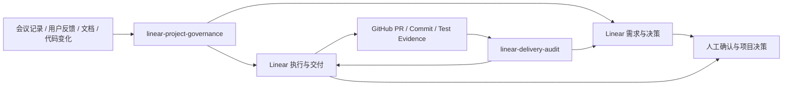

# Linear GPT PM

> 一个面向真实软件项目的 AI 项目治理工具包：使用可复用 Agent Skills，将会议记录、用户反馈、项目文档和代码证据，转化为 Linear 中可追踪的需求、决策、任务、风险和交付审查结果。

**Linear GPT PM** 不是简单的 Prompt 集合，而是一套围绕 AI Agent 工作流设计的项目治理能力。

它解决的问题不是“让 AI 帮忙写 Issue”，而是建立：

**输入信息 → AI 分析 → 人工确认 → Linear 管理 → GitHub 证据核验 → AI 反向审查 → 项目持续改进** 的闭环。

当前包含两个核心 Agent Skills：

- `$linear-project-governance`：需求治理与项目对账，将分散的信息整理为 Linear 中可管理的事项。
- `$linear-delivery-audit`：交付审查，将 Linear 状态与 GitHub、PR、测试等证据结合，发现未闭环风险。

当前版本：`0.1.0-alpha.3` · License：Apache-2.0

---

## 为什么需要 Linear GPT PM

随着 AI Coding 和 Agent 开发方式普及，项目管理出现新的问题：

- AI 可以快速生成代码，但需求来源容易丢失；
- Issue、PR、聊天记录、文档之间缺少关联；
- 任务显示完成，但缺少真实交付证据；
- 项目长期迭代后，负责人难以判断当前有效状态；
- 多个 AI Agent 协作时，需要明确权限和责任边界。

Linear GPT PM 的目标是让 AI 不只是“生成内容”，而是参与结构化的软件交付流程。

---

## 核心工作流



核心原则：

- Linear 是项目事实台账，而不是简单任务列表；
- GitHub 提供代码和测试证据；
- AI 负责整理、分析、检查和提出建议；
- 人保留需求批准、风险接受和发布决策权。

---

## 两个核心 Skills

| Skill | 用途 | 默认行为 |
| --- | --- | --- |
| `$linear-project-governance` | 需求、问题、决策、变更、风险整理；Linear 对账；任务拆解 | 先生成候选，正式写入需确认 |
| `$linear-delivery-audit` | 检查来源、负责人、完成标准、交付证据和项目健康状态 | 默认只读审查 |

---

## 真实案例：Infinite Canvas

该方法已应用于真实 AI 创作平台项目 **Infinite Canvas**。

实际建立：

- `Infinite Canvas｜需求与决策`
- `Infinite Canvas｜执行与交付`

真实治理内容包括：

- 采用 ChatGPT、Codex 与 Linear 共用治理体系；
- 建立需求、执行、证据之间的关联；
- 从仓库、PR、文档和用户反馈重建有效事项；
- 识别大型 Draft PR 带来的交付风险；
- 使用 GitHub 作为代码状态和验证证据来源。

实际闭环：

```text
真实项目输入
    ↓
AI 提取与整理
    ↓
人工确认
    ↓
Linear 需求 / 决策 / 执行任务
    ↓
GitHub 代码与测试证据关联
    ↓
AI 交付审查
    ↓
持续优化项目状态
```

---

## 快速开始

### 安装环境

支持：

- Codex
- 支持 Agent Skills 的 AI 开发环境
- Linear 集成
- GitHub 集成（用于代码证据审查）

### 安装 Skills

```text
$skill-installer install https://github.com/TAI-YE-1/linear-gpt-pm/tree/main/skills/linear-project-governance
$skill-installer install https://github.com/TAI-YE-1/linear-gpt-pm/tree/main/skills/linear-delivery-audit
```

或：

```powershell
git clone https://github.com/TAI-YE-1/linear-gpt-pm.git
cd linear-gpt-pm
python scripts/install_codex_skills.py
```

---

## 使用示例

需求整理：

```text
使用 $linear-project-governance 分析下面的会议记录。
先与当前 Linear 项目对账，只返回候选事项，不要写入。
```

交付审查：

```text
使用 $linear-delivery-audit 审查这个项目最近 30 天的交付状态。
保持只读，返回问题、证据和建议动作。
```

---

## 安全设计

Linear GPT PM 默认采用人机协作模式：

- 不自动批准需求；
- 不自动关闭风险；
- 不自动接受发布结果；
- 正式写入前需要人工确认；
- 审查默认只读；
- 不传递密码、密钥或敏感数据。

AI 是项目治理助手，不替代产品负责人和工程负责人。

---

## 当前状态

已完成：

- 两个可安装 Agent Skills；
- Linear 双项目治理模式；
- 需求治理和交付审查流程；
- 真实项目案例验证；
- 安装、测试和打包工具。

当前处于 Alpha 阶段：

- 更多团队规模验证；
- 长周期自动审查运行验证；
- 更多项目类型适配。

适用于：

- 个人 AI Coding 工作流；
- 小型研发团队；
- 内部 AI Agent 项目治理试点。

---

## Repository Structure

```text
skills/
  linear-project-governance/   # 需求治理 Skill
  linear-delivery-audit/       # 交付审查 Skill

scripts/
  install_codex_skills.py      # 安装工具
  build_skill_archives.py      # 打包工具

docs/
  quickstart.md
  integrations.md
  capability-boundaries.md
  reuse-guide.md

tests/
```

---

## License

Apache License 2.0
