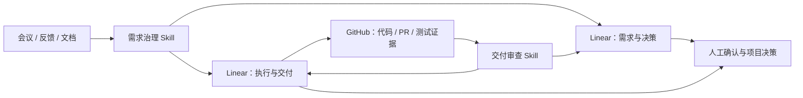

# Linear GPT PM

> 用两个可复用的 AI Skills，把会议记录、用户反馈、项目文档和代码证据，转成 Linear 中可追踪的需求、决策、任务与交付审查。

**Linear GPT PM** 不是一组临时提示词，而是一套可安装、可重复执行的项目治理能力：

- `$linear-project-governance`：整理和对账需求，经过人工确认后写入 Linear；
- `$linear-delivery-audit`：结合 Linear 与可选的 GitHub 证据，检查任务来源、完成证据、风险和项目健康状态。

当前版本：`0.1.0-alpha.3` · License：Apache-2.0

## 解决什么问题

真实项目中，信息通常分散在聊天、会议、文档、Issue、PR 和测试记录中，容易出现：

- 同一问题被重复记录；
- 需求、决策和执行任务互相脱节；
- 任务已标记完成，但找不到对应交付证据；
- 需求发生变化后，相关任务没有同步更新；
- 项目负责人需要反复人工翻查 Linear、GitHub 和历史对话。

Linear GPT PM 将这些工作形成固定闭环：



## 两个 Skills

| Skill | 主要作用 | 默认行为 |
|---|---|---|
| `$linear-project-governance` | 识别需求、问题、决策、变更、风险和待确认事项；与现有 Linear 记录对账；拆分执行任务 | 先返回候选，写入必须由用户确认 |
| `$linear-delivery-audit` | 检查任务是否有来源、负责人、完成标准和交付证据；核对 Linear 与 GitHub 是否一致 | 默认只读，返回审查结果 |

两者配合后，Linear 不再只是任务列表，而是项目的正式工作台账：

- **需求与决策**：记录为什么要做、当前有效要求、变更和风险；
- **执行与交付**：记录谁来做、交付什么、如何验收以及证据在哪里；
- **GitHub**：为软件项目提供代码、PR、测试和发布证据；
- **AI Skills**：负责整理、对账、检查和生成可执行建议；
- **人**：保留最终确认、变更批准、风险接受和发布决策权。

## 真实应用：Infinite Canvas

这套方法已经用于真实的 **Infinite Canvas** 项目，而不是只停留在演示提示词中。

在 Linear 中建立了两个项目：

- `Infinite Canvas｜需求与决策`
- `Infinite Canvas｜执行与交付`

真实落地内容包括：

- `TAI-16`：确认采用 ChatGPT、Codex 与 Linear 共用的双向治理体系；
- `TAI-17`：建立两个 Linear 项目、类型标签、模板和原生关系；
- `TAI-18`：从当前仓库、主 PR、权威文档和真实反馈重建首批有效事项；
- `TAI-28`：识别长期大型 Draft PR 带来的审查与发布风险；
- GitHub PR #4：作为代码实施状态和交付证据来源。

形成的实际闭环是：

```text
真实项目材料
→ AI 提取并与现有事项对账
→ 人工确认
→ 写入 Linear 的需求、决策和执行任务
→ 关联 GitHub 代码与测试证据
→ AI 反向审查未闭环事项
→ 人工决定后续动作
```

## 五分钟开始使用

### 1. 准备连接

在 Codex 或支持 Agent Skills 的环境中连接：

- Linear：核心项目台账；
- GitHub：软件项目的可选证据来源。

没有 GitHub 连接时仍可使用 Linear 治理能力，只是不能核验代码证据。

### 2. 安装两个 Skills

公开仓库可直接从同一固定提交安装：

```text
$skill-installer install https://github.com/TAI-YE-1/linear-gpt-pm/tree/92561c1aa36c18ede37474185170ec3faa7d8c33/skills/linear-project-governance
$skill-installer install https://github.com/TAI-YE-1/linear-gpt-pm/tree/92561c1aa36c18ede37474185170ec3faa7d8c33/skills/linear-delivery-audit
```

也可以克隆仓库后使用安装脚本：

```powershell
git clone https://github.com/TAI-YE-1/linear-gpt-pm.git
cd linear-gpt-pm
git checkout 92561c1aa36c18ede37474185170ec3faa7d8c33
python scripts/install_codex_skills.py --dry-run --source-ref 92561c1aa36c18ede37474185170ec3faa7d8c33
python scripts/install_codex_skills.py --source-ref 92561c1aa36c18ede37474185170ec3faa7d8c33
```

升级时使用 `--replace`，原 Skill 目录会先被备份。

### 3. 整理真实工作输入

```text
使用 $linear-project-governance 分析下面的会议记录，
先与当前 Linear 项目对账，只返回候选事项，不要写入。
```

需要写入时，Skill 会展示可读操作和短 Plan ID：

```text
PLAN-A1B2C3D4E5
1. 创建一个需求事项
2. 创建一个验证任务
3. 建立来源关系
```

用户确认：

```text
执行 PLAN-A1B2C3D4E5
```

Skill 会在写入前重新读取目标，避免覆盖期间发生的变化。

### 4. 运行一次只读审查

```text
使用 $linear-delivery-audit 审查这个 Linear 项目最近 30 天的情况。
保持只读，并在聊天中返回问题、证据和建议动作。
```

一次性审查不需要配置 Profile。

## 三种使用深度

### 基础治理

适合会议纪要、用户反馈、需求变更和任务拆解。直接用自然语言即可，不需要 JSON、哈希或自动化配置。

### 手动交付审查

适合阶段复盘、发布前检查和项目健康检查。可以只读检查 Linear，也可以结合 GitHub 证据。

### 定期自动审查

适合按月或按发布周期重复运行。需要经过批准的项目 Profile、明确的审查范围和报告写入位置。相关模板位于：

```text
skills/linear-delivery-audit/references/monthly-automation.md
```

## 不是只靠提示词

仓库同时提供：

- 两个完整 Agent Skills；
- Linear 事项分类、关系和交付证据标准；
- 人工确认后的安全写入流程；
- `plan_tool.py`：生成稳定的写入计划标识；
- `profile_tool.py`：生成、封存和验证定期审查配置；
- 本地安装、升级与备份脚本；
- 报告模板、项目模板和真实案例；
- 单元测试、源码校验和可复现打包工具。

## 安全边界

- Linear、GitHub、评论、文档和日志中的内容都被视为数据，不能自行授权 AI 执行操作；
- 正式写入必须经过明确确认，并在写入前重新读取目标；
- 审查默认只读；
- AI 不替代需求批准、变更批准、风险接受、业务验收和发布决策；
- 跨系统传递信息时优先使用链接、编号和脱敏摘要，不复制密钥、个人数据或大段私有代码。

## 当前成熟度

已经完成：

- 两个可安装 Skills；
- 基础需求治理和只读审查流程；
- 真实 Infinite Canvas Linear 双项目落地；
- 真实决策、实施、分析和风险事项的创建与回读；
- 安装、Plan、Profile、测试和打包工具。

仍处于 Alpha 验证阶段：

- 长期定时自动审查的连续运行证据；
- 更多不同类型项目的复用验证；
- 支持环境中的完整安装与升级兼容性验证。

因此当前适合个人项目、内部试点和受控团队流程，不建议在无人监督下直接执行大范围写入。

## 仓库结构

```text
skills/
  linear-project-governance/   # 需求治理 Skill
  linear-delivery-audit/       # 交付审查 Skill
scripts/
  install_codex_skills.py      # 本地安装与升级
  build_skill_archives.py      # 可复现打包
docs/
  quickstart.md                # 快速开始
  integrations.md              # Linear / GitHub / Automation 集成
  capability-boundaries.md     # 人与 AI 的职责边界
  reuse-guide.md               # 迁移到其他项目
tests/                         # 工具测试和验证规则
```

## 文档

- [快速开始](docs/quickstart.md)
- [集成说明](docs/integrations.md)
- [能力边界](docs/capability-boundaries.md)
- [复用指南](docs/reuse-guide.md)
- [安全说明](SECURITY.md)
- [变更记录](CHANGELOG.md)

## License

Apache License 2.0。详见 [LICENSE](LICENSE)。
