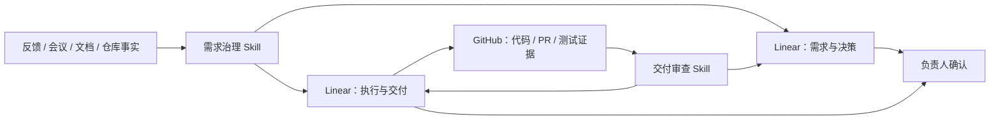

# 项目治理应用示例模板

本文展示 Linear GPT PM 在一个长期项目中的通用应用方式。所有名称、编号和链接均为占位符，不代表任何实际项目。

## 项目背景

假设 `<项目名称>` 在持续推进过程中出现以下问题：

- 用户反馈、会议记录、项目文档、Linear 事项和 GitHub 变更分散；
- 同一问题可能在不同阶段被重复记录；
- “已经实现”“已经测试”“已经验收”容易混为一谈；
- 一个长期 Draft PR 承载大量工作，当前范围和未完成验证难以快速判断；
- 执行任务与需求、决策和风险之间缺少稳定关系；
- 项目负责人需要反复翻查历史材料才能回答“为什么做、做到哪、证据在哪”。

## 设计目标

目标不是让 AI 直接接管项目，而是建立以下闭环：



其中：

- AI 负责整理、对账、拆分和检查；
- Linear 记录正式工作事实；
- GitHub 提供软件交付证据；
- 人保留需求批准、风险接受、验收和发布权。

## Linear 双项目结构

复杂项目可以采用双项目模式。

### `<项目名称>｜需求与决策`

用于记录：

- `REQ`：已接受需求；
- `PROB`：有证据支持的当前问题；
- `DEC`：正式决策；
- `CR`：对已接受内容的实质变更；
- `RISK`：需要跟踪和处理的风险；
- `Q`：可能影响决策或执行的待确认问题。

### `<项目名称>｜执行与交付`

用于记录：

- 分析任务；
- 实施任务；
- 验证任务；
- 协作任务；
- 完成标准、负责人、状态和证据链接。

执行任务通过 Linear 原生关系连接来源事项。这样可以从任务追溯“为什么做”，也可以从需求或风险查看“由哪些任务处理”。

## 事项示例

| Linear 事项 | 类型 | 作用 | 当前意义 |
|---|---|---|---|
| `<事项编号-DEC>` | 决策 | 确认采用统一的 AI + Linear 治理方式 | 固化工作方式和职责边界 |
| `<事项编号-实施>` | 实施 | 建立项目结构、类型标签、模板和关系 | 将方案落地为可使用结构 |
| `<事项编号-分析>` | 分析 | 从当前仓库、文档和真实反馈重建首批事项 | 避免直接搬运过时历史任务 |
| `<事项编号-RISK>` | 风险 | 记录长期大型 Draft PR 带来的审查和发布风险 | 将已知风险转成有负责人和处理方式的正式事项 |

这些事项可以通过 Linear 原生关系形成“决策 → 实施 / 分析”“风险 → 处理任务”的追踪链。

## Skills 如何参与

### 1. 需求治理 Skill

输入可以包括：

- 当前用户反馈；
- 项目基线和架构文档；
- Linear 现有事项；
- GitHub PR 元数据；
- 已确认的测试和验收结果。

Skill 执行：

1. 读取当前 Linear 项目和事项；
2. 区分事实、需求、问题、决策、风险和待确认问题；
3. 查找重复、过期或冲突内容；
4. 返回候选事项和任务关系；
5. 经负责人确认后写入 Linear；
6. 回读新事项、状态和关系。

### 2. 交付审查 Skill

审查时不会只看 Linear 中的状态，而会对照可访问证据，例如：

- `<PR编号>` 是否仍为 Draft；
- 代码是否已经提交；
- 测试是否与当前代码版本对应；
- 浏览器、真实 Provider 或端到端验证是否完成；
- 任务写成 Done 时是否有相应证据；
- 未完成验证是否被错误描述成完整交付。

审查结果应区分：

- 已有实现进展；
- 已有本地或聚焦测试；
- 尚未完成真实环境验证；
- 尚未完成外部服务验证；
- 尚未报告完整端到端结果。

这避免把“代码已经存在”直接等同于“功能已经验收”。

## 一个完整工作示例

以长期大型 Draft PR 风险为例：

```text
GitHub 当前状态和历史事实
→ 需求治理 Skill 判断为 RISK，而不是普通开发任务
→ 人工确认风险内容和处理方式
→ 在 Linear 创建 <事项编号-RISK>
→ 记录负责人、风险影响和下一步
→ 关联 <处理任务编号>
→ 交付审查 Skill 持续检查风险是否仍存在
```

最终结果不是一段临时建议，而是 Linear 中可持续追踪的正式事项。

## 带来的变化

### 原来

- 依靠对话记忆和人工翻查；
- 任务标题可以存在，但来源和验收标准不稳定；
- GitHub 状态与项目管理状态需要人工拼接；
- 同一事实可能被不同人解释成不同完成状态。

### 使用后

- 需求、决策、风险和执行任务有明确分类；
- 执行任务能够追溯来源；
- GitHub 证据与 Linear 工作事实分工明确；
- AI 可以重复运行同一套对账和审查流程；
- 负责人只在关键确认和决策点介入。

## 替换占位符

应用到自己的项目时，需要替换：

- `<项目名称>`；
- `<需求项目名称>` 和 `<执行项目名称>`；
- `<事项编号-DEC>`、`<事项编号-实施>`、`<事项编号-分析>`、`<事项编号-RISK>`；
- `<owner/repo>`；
- `<PR编号>`；
- `<处理任务编号>`；
- 团队、标签、状态、负责人和证据来源。

不要修改共享 Skill 源码来硬编码项目名称。

## 相关文档

- [快速开始](../quickstart.md)
- [集成说明](../integrations.md)
- [复用指南](../reuse-guide.md)
- [能力与职责边界](../capability-boundaries.md)
