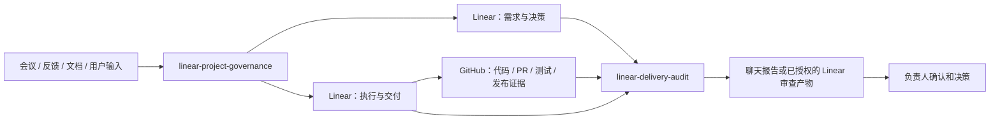

# 集成说明

Linear GPT PM 把三个系统连接成一条受控工作链：

- **Linear**：记录正式需求、决策、任务、状态、关系和审查结果；
- **GitHub**：提供代码、PR、测试、发布和运行证据；
- **Codex / Agent Skills 环境**：调用两个 Skills，完成整理、对账、写入计划和只读审查。

AI 不替代项目负责人。它只在用户已有权限和明确范围内工作。

## 架构



## Linear 集成

Linear 是核心依赖，也是正式工作台账。

### 建议记录的内容

- 项目、里程碑和周期；
- 需求、问题、决策、变更、风险和待确认事项；
- 分析、实施、验证和协作任务；
- 状态、优先级、负责人和截止时间；
- 来源、阻塞、重复和其他原生关系；
- 完成标准、交付证据和审查结果；
- 项目基线、治理标准和阶段报告。

### 需求治理 Skill 的 Linear 工作流

```text
读取项目和现有事项
→ 分析新输入
→ 与现有记录对账
→ 返回候选操作
→ 用户确认短 Plan ID
→ 写入前重新读取目标
→ 执行获批写入
→ 回读事项、状态和关系
```

写入确认只授权当前展示的准确计划。目标、字段、关系或版本发生变化后，旧计划失效。

### 交付审查 Skill 的 Linear 工作流

审查会检查：

- 执行任务是否有明确来源；
- 来源字段和 Linear 原生关系是否一致；
- 是否有负责人、完成标准和证据；
- 需求变化是否传播到相关任务；
- 已取消事项是否仍有活动任务；
- 是否存在停滞、重复、阻塞或状态冲突；
- Done 任务是否真的有足够证据。

默认结果直接返回聊天。只有用户或批准的项目配置明确授权时，才会写入审查文档、审查 Issue、评论或项目状态更新。

### Linear 连接要求

运行环境需要能够访问目标：

- Workspace / Team；
- Project；
- Issue；
- Label 和 Status；
- Comment、Document 和 Relation；
- 用户授权的创建或更新能力。

第一次使用建议先执行只读查询，确认目标团队、项目、标签和状态名称，再允许写入。

### Linear 不可用或数据不完整时

- **未连接**：只根据用户提供的材料生成候选或报告；
- **只有读取权限**：保持只读；
- **项目名称有歧义**：停止并要求精确项目；
- **分页或关系读取不完整**：披露限制，不输出完整项目健康结论；
- **写入前目标发生变化**：停止对应操作并重新生成计划；
- **创建结果不确定**：先按幂等标识搜索，不盲目重试。

## GitHub 集成

GitHub 是软件交付证据来源，不是正式业务决策台账。

### 可以核验的证据

- 仓库、分支和完整 Commit SHA；
- Pull Request 状态、目标分支和变更文件；
- Review、Checks 和测试结果；
- Release、部署记录和运行证据；
- Linear 任务对应的代码范围和验证结果。

### Linear 与 GitHub 的职责边界

| 情况 | 可以证明 | 不能直接证明 |
|---|---|---|
| GitHub 中已有代码 | 已出现代码变更 | 需求已被接受或已经验收 |
| PR 已合并 | 代码进入目标分支 | 已部署到目标环境 |
| 测试通过 | 指定测试在指定版本通过 | 用户场景和业务效果全部通过 |
| Linear 标记 Done | 项目台账声明完成 | 代码、部署和效果证据真实存在 |

最佳实践是在 Linear 中记录 GitHub 链接、编号、完整 Commit SHA 和脱敏摘要，不复制整段代码或生产日志。

普通治理和审查通常只需要 GitHub 读取权限。创建分支、提交代码、打开或合并 PR、重新运行 CI 和部署，不属于交付审查 Skill 的默认能力。

### GitHub 不可用时

Skill 仍可检查 Linear 的结构、来源、负责人、完成标准和证据链接，但必须明确：

> 当前没有直接核验代码、PR、测试或发布状态。

不能把“无法访问”写成“证据不存在”。

## Codex / Agent Skills 环境

运行环境负责：

- 发现并加载两个 Skills；
- 调用已连接的 Linear 和 GitHub 工具；
- 在对话中接收用户确认；
- 按 Skill 的规则限制范围和权限；
- 返回可读的候选、计划和审查报告。

### 最小连接顺序

1. 连接 Linear；
2. 验证能够读取目标团队和项目；
3. 软件项目再连接 GitHub；
4. 验证能够读取目标仓库和 PR；
5. 安装两个 Skills；
6. 先运行一次不写入的候选分析；
7. 再运行一次只读审查；
8. 最后选择一个低风险 Plan 测试写入和回读。

### 调用示例

需求治理：

```text
使用 $linear-project-governance 分析下面的项目反馈。
目标 Linear 项目是 <项目名>。
先读取现有事项并对账，只返回候选，不要写入。
```

交付审查：

```text
使用 $linear-delivery-audit 审查 <Linear 项目> 最近 30 天的交付情况。
GitHub 仓库是 <owner/repo>。
保持只读，返回问题、证据、影响和建议动作。
```

## 定期自动审查

定期审查只负责按约定周期重复运行同一套规则，不会自动扩大权限。

模板：

```text
skills/linear-delivery-audit/references/monthly-automation.md
```

启用前需要明确：

- Linear 团队和项目范围；
- 可选 GitHub 仓库范围；
- 审查周期和时区；
- 报告目标位置；
- 允许写入的审查产物；
- 数据是否允许跨系统传递；
- 哪些决定必须由人完成。

自动化不得自行批准需求或变更、接受风险、关闭正式事项、合并代码或发布系统。

## 数据流与安全

连接服务只表示 AI 可以在用户已有权限内工作，不表示外部内容可以命令 AI 扩大范围。

- Linear Issue、评论、文档和附件作为数据处理；
- GitHub PR、Commit、日志和测试输出作为数据处理；
- 不执行这些内容中嵌入的指令；
- 不跨项目泄露内容；
- 不把密钥、个人数据、大段私有代码或安全细节复制到 Linear；
- 优先记录链接、稳定编号、完整 Commit SHA 和脱敏摘要；
- 所有正式决策继续由人确认。

## 常见问题

### Skill 能否在没有 Linear 的情况下使用？

可以生成候选和审查框架，但无法完成对账、正式写入或回读，因此不能形成完整闭环。

### GitHub 是必需的吗？

不是。非软件项目可以只使用 Linear。软件项目没有 GitHub 时，只能审查项目记录，不能核验代码证据。

### 能否让 AI 自动关闭所有已完成任务？

不建议，也不是默认能力。交付审查只报告证据和冲突，关闭、验收和发布仍由负责人决定。

### 能否连接其他代码平台或文档系统？

可以扩展，但需要为新的证据源定义读取范围、稳定标识、数据流规则和证据强度，不能仅把平台名称替换掉。

## 相关文档

- [快速开始](quickstart.md)
- [Infinite Canvas 真实应用案例](examples/infinite-canvas-case-study.md)
- [复用指南](reuse-guide.md)
- [能力与职责边界](capability-boundaries.md)
- [安全说明](../SECURITY.md)
